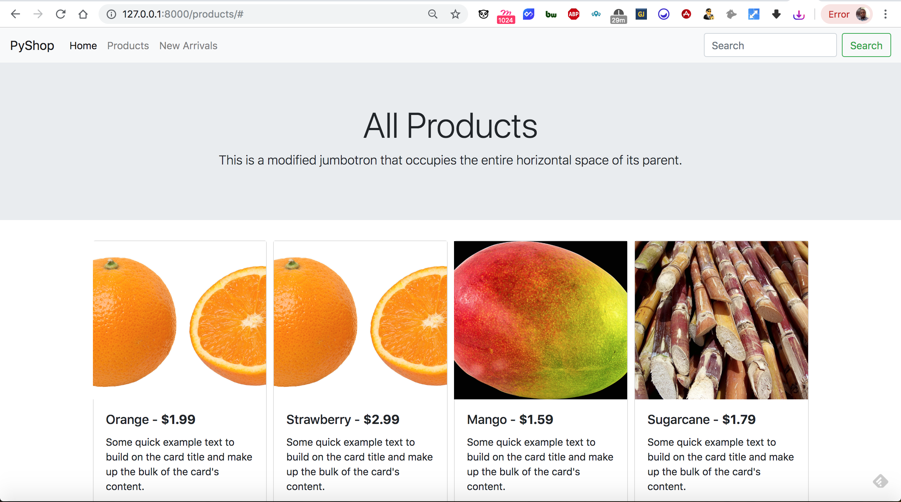

# 📚 BookBreeze Books

A full-stack online bookstore built with **Python and Django**, featuring user authentication, book discovery, search and filtering, shopping cart, wishlist, checkout, order management, stock validation, and a responsive Bootstrap interface.

BookBreeze Books was developed as a portfolio project to demonstrate practical backend development, database design, Django ORM, authentication, transactional workflows, and responsive web application development.

---

## 🚀 Live Demo

🔗 **Live Demo:** Coming soon

🔗 **GitHub Repository:** [https://github.com//vishnupriyasreedharangp-stack/BookBreeze-Books
](https://github.com/vishnupriyasreedharangp-stack/BookBreeze)
---

## 📸 Project Preview

### Home Page



---

## ✨ Features

### 👤 User Authentication

- User registration and login
- Django authentication system
- Secure session-based authentication
- Login-protected shopping features
- Logout functionality

### 📖 Book Catalogue

- Browse available books
- Book categories
- Book details
- Author information
- ISBN information
- Pricing and stock availability
- Book cover images
- New arrivals section

### 🔎 Search & Filtering

Users can discover books using:

- Keyword search
- Category filtering
- Newest books
- Price: Low to High
- Price: High to Low
- Name-based sorting

### 🛒 Shopping Cart

- Add books to cart
- Increase product quantities
- Remove items
- Automatic subtotal calculation
- Automatic cart total
- Stock-aware purchasing

### ❤️ Wishlist

- Add books to wishlist
- Remove books from wishlist
- Prevent duplicate wishlist items
- Dedicated wishlist page

### 💳 Checkout & Orders

- Checkout from cart
- Validate product stock before ordering
- Create orders and order items
- Automatically calculate order totals
- Reduce inventory after successful purchase
- Clear cart after successful checkout
- Order success page
- Order history
- Individual order details

### 📦 Inventory Management

- Product stock tracking
- Stock validation during checkout
- Prevent purchases when sufficient stock is unavailable
- Inventory automatically updated after successful orders

### 🔐 Transaction-Safe Checkout

Checkout processing uses Django database transactions to keep order creation, inventory updates, and cart clearing consistent.

The checkout workflow uses:

- `transaction.atomic()`
- `select_for_update()`
- Stock validation
- Order and OrderItem creation
- Inventory updates

This helps prevent inconsistent order and inventory states during concurrent requests.

### 🛠️ Django Admin

The project includes a customized Django Admin interface for managing:

- Categories
- Products
- Offers
- Orders
- Order items

Orders include inline order-item management for easier administration.

---

## 🧰 Tech Stack

| Technology | Purpose |
|---|---|
| Python 3.12 | Backend programming |
| Django 5.2.7 | Web framework |
| SQLite | Development database |
| Django ORM | Database interaction |
| HTML5 | Page structure |
| CSS3 | Styling |
| Bootstrap 5 | Responsive UI |
| Bootstrap Icons | Interface icons |
| JavaScript | Client-side interactions |
| Git | Version control |
| GitHub | Source code hosting |

---

## 🏗️ Project Architecture

The application follows a Django project/app structure:

```text
BookBreeze-Books/
│
├── manage.py
├── requirements.txt
├── README.md
├── .gitignore
│
├── pyshop/
│   ├── settings.py
│   ├── urls.py
│   ├── wsgi.py
│   └── __init__.py
│
├── products/
│   ├── admin.py
│   ├── apps.py
│   ├── forms.py
│   ├── models.py
│   ├── urls.py
│   ├── views.py
│   │
│   ├── management/
│   │   └── commands/
│   │       └── fetch_book_covers.py
│   │
│   └── migrations/
│
├── templates/
│   ├── base.html
│   ├── home.html
│   ├── index.html
│   ├── product_detail.html
│   ├── cart.html
│   ├── wishlist.html
│   ├── checkout.html
│   ├── order_detail.html
│   ├── order_history.html
│   └── registration/
│
└── static/
    └── books/
        ├── 9781593279288.jpg
        ├── 9780132350884.jpg
        ├── 9780135957059.jpg
        ├── 9780735211292.jpg
        ├── 9780857197689.jpg
        ├── 9780804139298.jpg
        ├── 9780062315007.jpg
        ├── 9780451524935.jpg
        ├── 9780553380163.jpg
        └── 9780062316097.jpg
